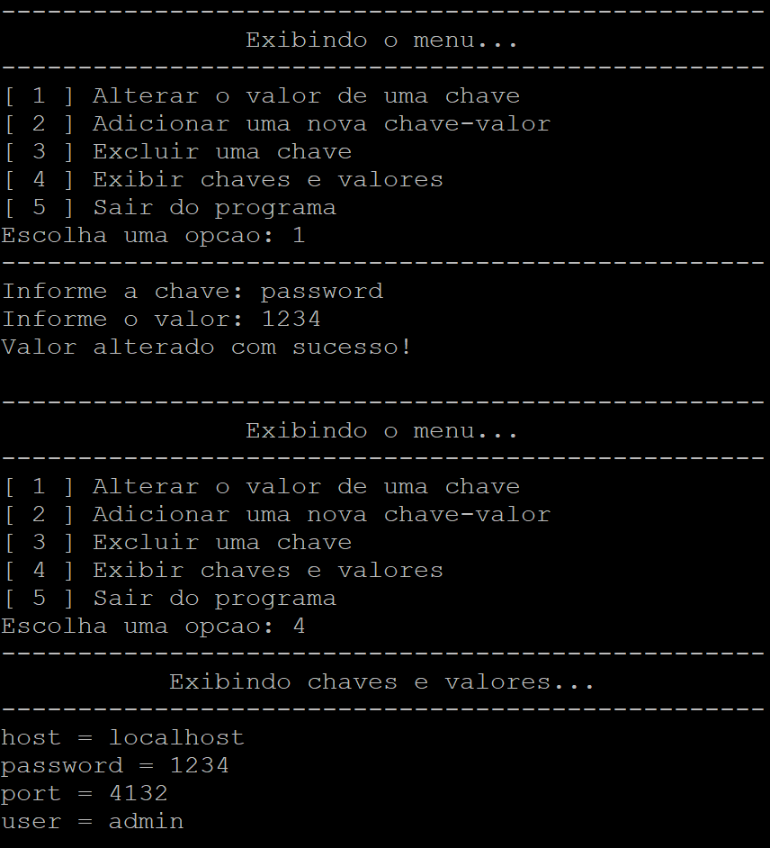

# Ini File Manager 

# Sobre o projeto

O INI File Manager é uma aplicação em C++ que permite manipular arquivos de configuração no formato .ini em sistemas UNIX, facilitando a leitura, alteração, adição e exclusão de chaves e valores. Além disso, o programa ajusta automaticamente a formatação do arquivo .ini, removendo espaços desnecessários ao redor de chaves e valores, garantindo uma exibição mais organizada.

## Funcionalidades

- Leitura de Arquivos INI: Lê o arquivo .ini e extrai as chaves e valores, removendo espaços extras ao redor dos mesmos.

- Formatação Automática: Ao salvar o arquivo .ini, o programa remove quaisquer espaços desnecessários ao redor de chaves e valores, garantindo uma melhor legibilidade.

- Alterar Chave/Valor: Permite alterar o valor de uma chave existente.

- Adicionar Chave/Valor: Adiciona uma nova chave e valor ao arquivo.

- Excluir Chave: Remove uma chave existente do arquivo.

- Exibir Chaves e Valores: Lista todas as chaves e seus valores associados, com 
espaçamento entre as chaves, separadores e valores de forma apropriada para melhor visualização.

- Persistência em Arquivo: Grava as alterações no arquivo .ini.

# Estrutura do Código

Este projeto foi desenvolvido com base nos princípios do Clean Code, priorizando a legibilidade, simplicidade e modularidade. Cada função tem um propósito claro e bem definido, facilitando a manutenção e expansão futura do código. Além disso, o uso de nomes significativos e a organização lógica do fluxo do programa garantem que qualquer desenvolvedor possa entender o funcionamento e realizar ajustes com facilidade.

O código é dividido nas seguintes funções principais:

- **extract_key_value_from_ini**: Extrai as chaves e valores do arquivo INI, removendo espaços indesejados, e armazena no map.

- **change_key_value**: Altera o valor de uma chave existente.

- **add_key_value**: Adiciona uma nova chave-valor ao mapa.

- **delete_key**: Remove uma chave do mapa.

- **print_key_value**: Exibe todas as chaves e valores no console com uma formatação clara e centralizada.

- **write_ini_file**: Grava as chaves e valores do mapa no arquivo INI com formatação padronizada.

# Execução

Antes da execução do programa o arquivo ini se encontra sem formatação:

## Informar o diretório e nome do arquivo

## Opção 1 - Alterar o valor de uma chave

## Opção 2 - Adicionar uma nova chave-valor

## Opção 3 - Excluir uma chave

## Opção 5 - Sair do programa

## Resultado

Após a execução do programa, o arquivo ini se encontra formatado e com as chaves e valores atualizados.

# Autor

### João Matheus Carneiro de Miranda

